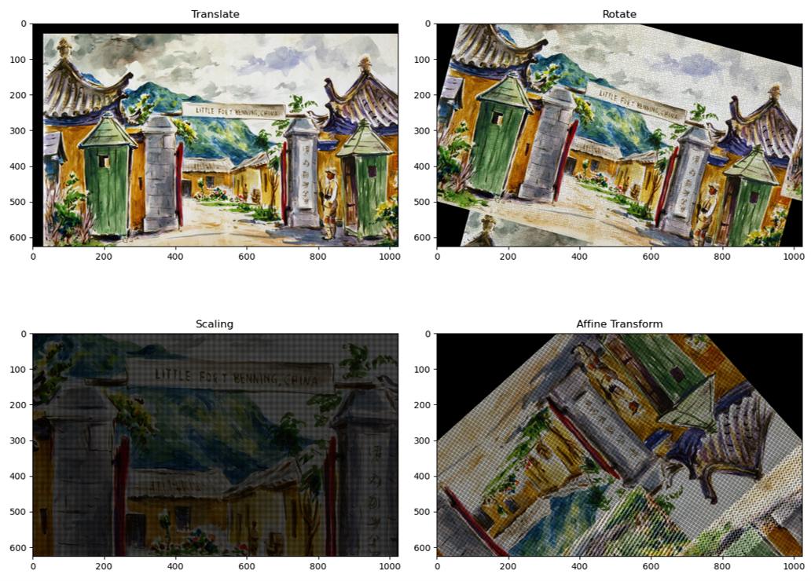
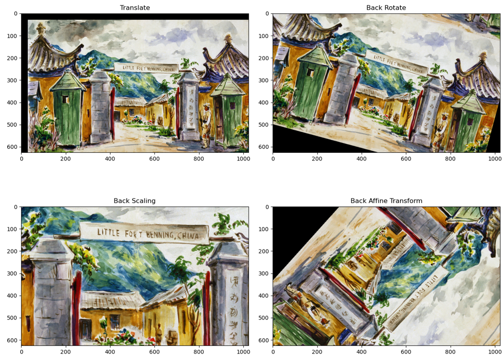

# Affine_Transform_naive_python
📦 Toy Box] Image Affine Transform without NumPy, OpenCV
==== 
- This repository implements image affine transformation using naive python.
- The use of NumPy, OpenCV, and Pillow in this code is very limited, and is used only for reading and storing image.
- It can be a good reference for you to study affine transform.
<br></br>
## 🏷 Table of content
- [Affine Transform](#AffineTransform)<br>
- [Getting Start](#GettingStart)<br>
- [Result](#Result)<br>
---
## 🦾 Affine Transform <a name = 'AffineTransform'></a>
### Properties of Affine Trnasformation
- Combines linear transformations, and translations.
- Origin does not necessarily map to origin.
- Lines map to lines.
- Parallel lines remain parallel.
- Ratios are preserved.

### How to do Affine Transform?
1. Find hte current center (cx, cy) of the image and translate it so that the origin is at (-cx, -cy).
2. Scale the image about the origin by scale factor (sx, sy).
3. Rotate the image about the origin by angle theta.
4. Find the new center (tx, ty) of the image and translate the image by (tx, ty) so the new center will end up in the center of the image canvas. 

### Basic Transformation Matrix
- Translate : `[[1, 0, tx], [0, 1, ty], [0, 0, 1]]`
- Scaling : `[[sx, 0, 0], [0, sy, 0], [0, 0, 1]]`
- Rotation : `[[cos(θ), -sin(θ), 0], [sin(θ), cos(θ), 0], [0, 0, 1]]`
- shift center : `[[1, 0, -cx], [0, 1, -cy], [0, 0, 1]]`
- coordinates : `[x, y, 1]`

### Standard Affine Transform Matrix
- a : `sx * cos(θ)`
- b : `sy * -sin(θ)`
- c : `tx`
- d : `sx * sin(θ)`
- e : `sy * cos(θ)`
- f : `ty`
- Affine : `[[a, b, c], [d, e, f], [0, 0, 1]]`

### Inverse Transformation Matrix
- Back Scaling : `[[1/sx, 0, 0], [0, 1/sy, 0], [0, 0, 1]]`
- Back Rotation : `[[cos(-θ), -sin(-θ), 0], [sin(-θ), cos(-θ), 0], [0, 0, 1]]`

### Inverse Affine Transform Matrix
- a : `cos(-θ) / sx`
- b : `-sin(-θ) / sy`
- c : `tx`
- d : `sin(-θ) / sx`
- e : `cos(-θ) / sy`
- f : `ty`
- Inverse Affine : `[[a, b, c], [d, e, f], [0, 0, 1]]`

### Bilinear Interpolation
- 
- As we perform scale or rotation transformations, many points are computed as floating-point numbers, 
  resulting in the loss of pixel values.
- It can be seen that a lot of regular noises is generated.
- In such cases, the inverse operation of the target image can obtain the original position. 
- However, the original image coordinates calculated after inverse operations are also floating point numbers.
- In such cases, the method used to obtain approximate values is `bilinear interpolation`.
- `f(i + u, j + v) = (1 - s) * (1 - t) * f(i, j) + (1 - s) * t * f(i + 1, j) + (1 - t) * s * f(i, j + 1) + s * t * f(i + 1, j + 1)`

## ⚙ Getting Start <a name = 'GettingStart'></a>
### Directory structure
```
├─config
├─image
├─output
└─src
    ├─transform 
    └─utils       
```
### Config
- You can set various experimental environments in `configs/config.py`
``` yaml
back:
  mode: 'back'                                # You can choose 'back' or 'base'. When 'back' mode is selected, scaling becomes bilinear interpolation.
  image_path: './image/test.jpg'              # Input image path
  output_path: './output/output_back.png'     # Path to save result image
  is_save: True                               # Save option
  translate:                                  
    tx: 30                                    # x coordinates to translate
    ty: 30                                    # y coordinates to translate
  rotate:
    degree: 15                                # Angle
  scaling:                                      
    sx: 2                                     # x scale factor
    sy: 2                                     # y scale factor
  affine:
    tx: 30
    ty: 30
    degree: 132
    sx: 1.3
    sy: 1.3

base:
  mode: 'base'
  image_path: './image/test.jpg'
  output_path: './output/output_base.png'
  is_save: True  
  translate:
    tx: 30
    ty: 30
  rotate:
    degree: 15
  scaling:
    sx: 2
    sy: 2
  affine:
    tx: 30
    ty: 30
    degree: 132
    sx: 1.3
    sy: 1.3
```
### Demo
- `python demo.py --config base`
---
## 👀 Results <a name = 'Result'></a>
### Standard Affine Transform
- 
### Inverse Affine Transform with bilinear interpolation
- 
